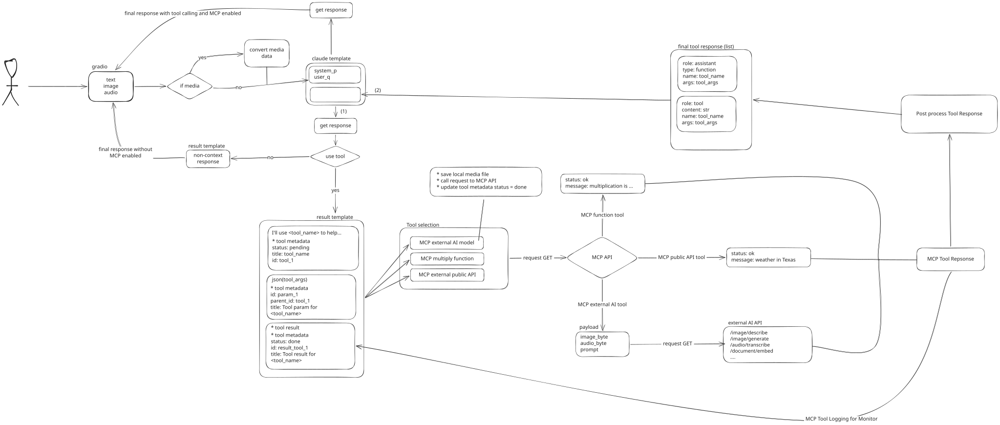

# **MCP Application**

This is a locally hosted Chatbot with MCP integrated.

## Overall flow:



## Overall features:

- Locally hosted LLM: The chatbot uses Ollama LLM model and deploy on local machine
- MCP Client and Server: MCP tools are built in MCP server and FastMCP integrated with LLM as MCP Client.
- Image Gen Tool: Integrate locally deployed Image Generation model as an API endpoint into MCP tools for functionality.

## Setups

**1. LLM with llama-server**

Make sure you have llama-server installed.

- Pull the model

`llama-server -hf bartowski/Qwen2.5-3B-Instruct-GGUF:Q5_K_S --port 4001 --jinja`

**2. Install Dependencies**

This project uses [uv](https://github.com/astral-sh/uv) for package management.

**Install uv first (if not already installed):**

```
curl -LsSf https://astral.sh/uv/install.sh | sh
```

**Install the project:**

```
cd mcp_test/mcp_assistant
uv sync
```

**Optional: Activate the virtual environment:**

```
source .venv/bin/activate
```

**Install Deepseek for image description:**

```
git clone https://github.com/deepseek-ai/DeepSeek-VL.git
cd DeepSeek-VL
uv pip install -e .
```

<!-- **Install Qwen-ASR for audio transcription:**

```
pip install -U qwen-asr
``` -->

**3. Start External API endpoint:**

External API endpoint contains self-built AI services deployed through API endpoints for MCP communication

Open a terminal

```
cd server/
uv run python main_api.py
```

The server will start on `http://localhost:3001`

**4. Startup MCP Server:**

    We will startup the MCP Server with all of the tools.

    Currently, there are 4 tools:

    - **get_alerts:** Call a request to an external API for weather alert based on the US state.

    - **get_forecast**: Call a request to an external API for weather alert based on the latitude and longtitude.

    - **get_multiply**: Do multiplicate between 2 numbers.

    - **generate_image**: Call to the hosted FastAPI Image Generation model.

    Open a second terminal

    ```
    cd mcp_test/mcp_assistant
    uv run python servers/main_mcp.py
    ```

    The server will start on `http://localhost:8000`

**5. Startup the main app:**

    This project uses Gradio as the UI of the application which has a chatbot interface along with uploading and displaying images from the tools.

    Open a third terminal

    ```
    cd mcp_test/mcp_assistant
    uv run python servers/app.py
    ```

    The server will start on `http://localhost:7860`
